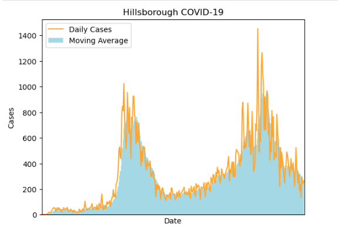
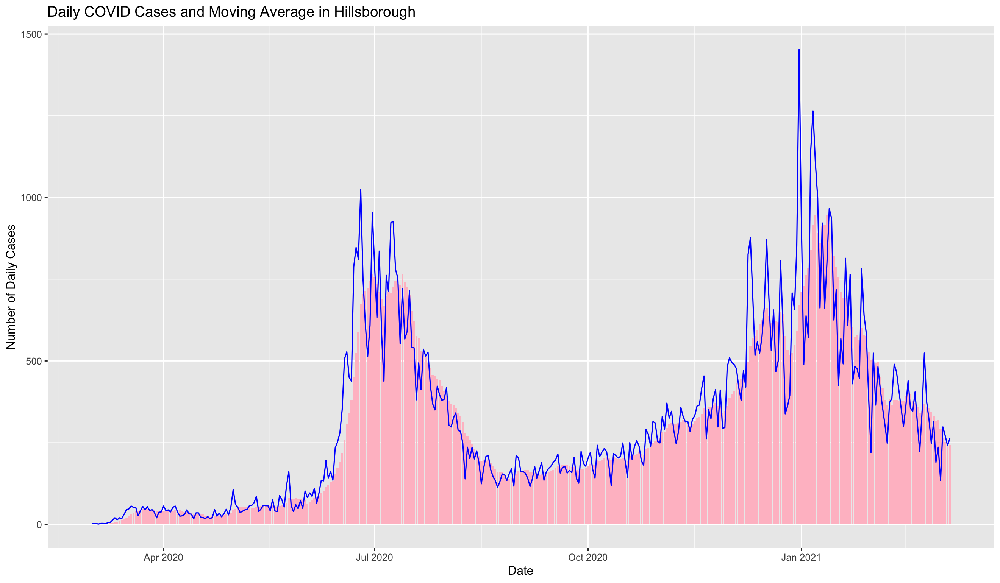
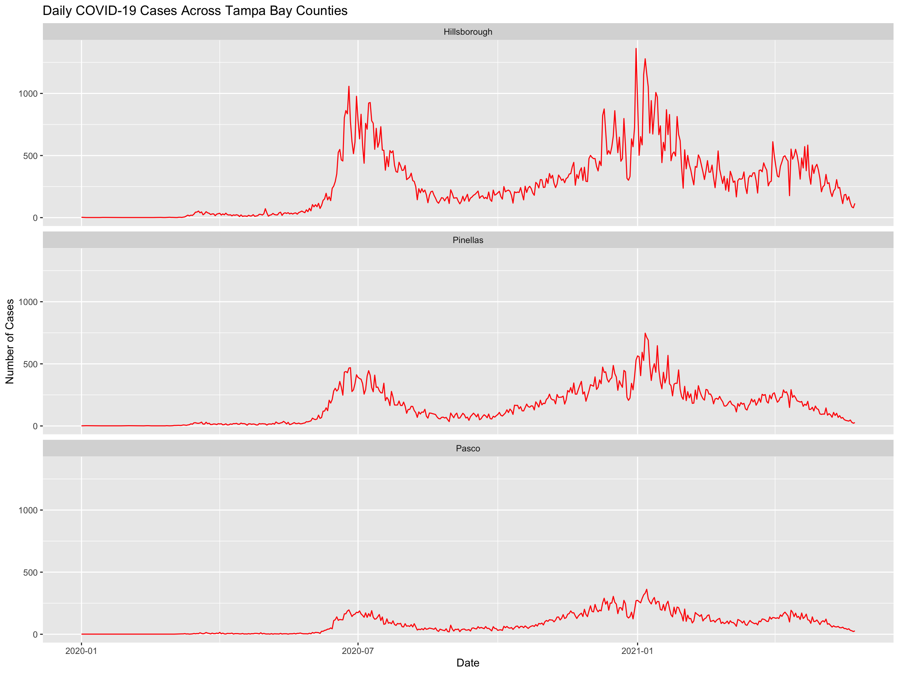

# COVID-19 Public Health Trend Analysis

## Overview

Public health analytics project examining COVID-19 trends in Florida using Python, R, Tableau, and Power BI.

The analysis focuses on daily case patterns, rolling averages, and county-level comparisons to make short-term fluctuations easier to interpret and highlight broader trends over time.

## Business & Public Health Questions

- How did daily COVID-19 case counts change over time?
- How can moving averages help reveal underlying trends in highly variable daily case data?
- How did COVID-19 trends differ across major Tampa Bay counties?
- How can the same public health data be analyzed and communicated across multiple analytics tools?

## Tools & Technologies

- Python
- pandas
- Matplotlib
- R
- ggplot2
- Tableau
- Power BI
- Data Cleaning
- Time-Series Visualization
- Rolling / Moving Average Analysis

## Analysis

### Daily Case Trends

Daily COVID-19 case counts were analyzed over time to identify changes in infection activity and periods of increased or decreased case volume.

### Moving Average Analysis

Moving averages were used to smooth daily fluctuations and make longer-term COVID-19 trends easier to interpret.

### County-Level Comparison

COVID-19 trends were compared across Tampa Bay counties, including:

- Hillsborough County
- Pinellas County
- Pasco County

### Multi-Tool Analysis

Similar public health analyses were explored across Python, R, Tableau, and Power BI, demonstrating how the same underlying data can be transformed and communicated through different analytics platforms.

## Visualization Highlights

### Python — Hillsborough COVID-19 Trends

Python was used to visualize daily COVID-19 cases alongside a moving average to make broader case trends easier to interpret.

### R — Hillsborough COVID-19 Trends

R and ggplot2 were used to recreate the Hillsborough County analysis and compare daily case volatility with the moving-average trend.

### Tampa Bay County Comparison

Daily case trends were compared across Hillsborough, Pinellas, and Pasco counties to highlight differences in outbreak patterns across the Tampa Bay area.

## Portfolio Reconstruction

This repository is a portfolio reconstruction based on coursework completed in **ISM 4930: Data Visualization**.

The original coursework included COVID-19 analysis using Python, R, Tableau, and Power BI. Selected code in this repository has been cleaned and reconstructed from coursework materials and documented analysis workflows for portfolio presentation.

The restricted course dataset is not included in this repository.

## Skills Demonstrated

- Public health data analysis
- Time-series analysis
- Moving-average calculations
- Data cleaning and transformation
- County-level trend comparison
- Python and R programming
- Data visualization
- Cross-platform analytics
